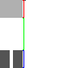

# BlockBenchTitleGenExtra

tools for creating minecraft title textures

## How to use the system

### Applying a style scheme to a title texture

1. Copy/Paste a title's `flat.png` texture into the [inputs folder](/inputs/) and rename it to something unique
2. Run [main.py](src/main.py) in the command line with arguments for:
    - `title's texture name`
    - `top height`
    - `face height`
    - `bottom height`  

        

3. Output will appear in [out/](/out/) under the same name as the input file

### Adding a style scheme

1. Choose a name for your style scheme. All files you make will be correlated to this name
2. copy the template folder in [run/](/run/) and rename it to your style scheme name
3. look through all the folders in your new style folder and read the READMEs in each one

